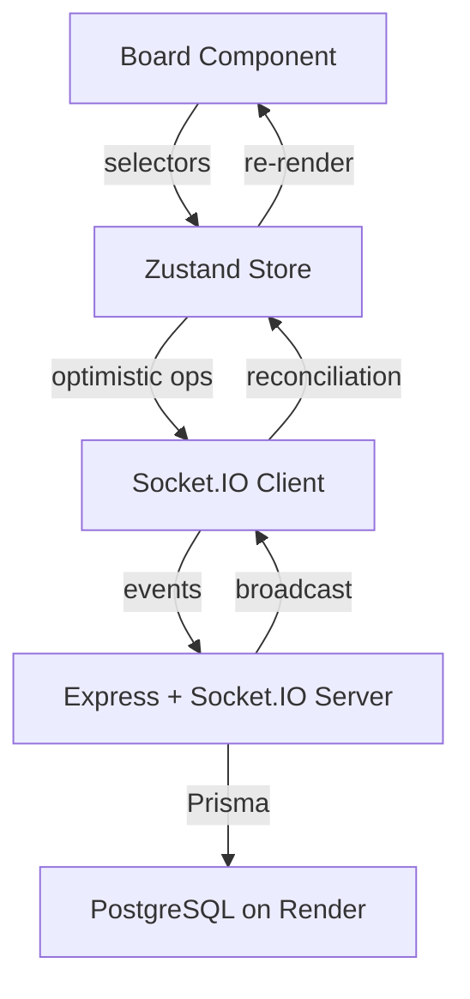

# Architecture & Design Decisions

## Real-Time Collaborative Task Board

### Overview
A split-stack Kanban board enabling real-time multi-user collaboration with conflict resolution, optimistic updates, and offline support.

---

## 1. Fractional Indexing (O(1) Reordering)

Instead of integer positions (requiring O(N) renumbering), task ordering uses **base-62 lexicographic string keys**.

```
Key:    "N"      "V"      "c"
Task:   Task A → Task B → Task C
```

**Inserting between B and C** generates a midpoint key `"Y"` without touching any existing rows:

```sql
-- Only 1 row updated instead of shifting every subsequent task
UPDATE "Task" SET "orderKey" = 'Y' WHERE id = ...
```

The algorithm operates on character codes (0-9, A-Z, a-z = 62 symbols), computing lexicographic midpoints. If adjacent keys differ by only 1 character, the system appends additional characters to create space.

---

## 2. Optimistic Concurrency Control (OCC)

Every `Task` row carries a `version` integer. All mutations include the version in the `WHERE` clause:

```sql
UPDATE "Task"
SET title = 'New Title', version = version + 1
WHERE id = $1 AND version = $expectedVersion
```

| Scenario | Resolution |
|---|---|
| Version matches | Update succeeds, version increments |
| Version mismatch | `updateMany` returns count=0 → conflict detected |
| Client receives conflict | Fires `REQUEST_SYNC` to reconcile full state |

### Field-Level Updates
Edit operations only send changed fields, so concurrent title and description edits on the same task don't conflict unnecessarily.

---

## 3. Socket.IO Event Protocol

| Client → Server | Server → All Clients |
|---|---|
| `TASK_CREATE` | `TASK_CREATED` |
| `TASK_UPDATE` (+ version) | `TASK_UPDATED` |
| `TASK_MOVE` (+ version) | `TASK_MOVED` |
| `TASK_DELETE` (+ version) | `TASK_DELETED` |
| `TASK_LOCK` | `TASK_LOCKED` |
| `TASK_UNLOCK` | `TASK_UNLOCKED` |
| `REQUEST_SYNC` | `TASKS_SYNC` |

All incoming payloads are validated with **Zod schemas** before reaching the service layer.

---

## 4. Presence & Locking

When a user edits a task:
1. Client emits `TASK_LOCK { id, userId }`
2. Server sets `lockedBy` on the row and broadcasts `TASK_LOCKED`
3. Other clients show a colored border + lock icon on that card
4. On save/cancel, `TASK_UNLOCK` clears the lock
5. On disconnect, server auto-unlocks all tasks held by that user

---

## 5. Offline Replay Queue

```
[Connected] → Actions emit immediately via socket
[Disconnected] → Actions queue in memory (Zustand state)
[Reconnected] → Queue replays sequentially, conflicts resolved via OCC
```

The UI shows an animated offline banner with queued action count.

---

## 6. State Architecture



**Key pattern:** The Board uses individual Zustand selectors (`useTaskStore(s => s.tasks)`) instead of destructuring, ensuring React re-renders precisely when data changes. Column tasks are derived via `useMemo`.

---

## 7. Deployment Architecture

The application is deployed across two separate platforms:
- **Frontend**: Hosted on Vercel at `https://silq.vercel.app/`
- **Backend & Database**: Hosted on Render (with managed PostgreSQL) at `https://silq.onrender.com/`

The frontend communicates with the backend via REST for initial loads and `Socket.IO` for real-time synchronization. Cross-Origin Resource Sharing (CORS) is explicitly configured on the backend to accept WebSocket connections from the Vercel hosted client.
